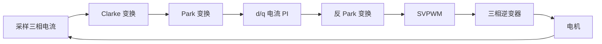

# FOC 算法原理与实现记录


## 1. FOC是什么

FOC 是 Field Oriented Control 的缩写，中文一般称为：
磁场定向控制

## 2. 电机模型与基本概念


*图 1：三相逆变器、永磁同步电机及电流路径示意图。*

无刷电机跟有刷电机的区别, 顾名思义就是无刷电机没有了有刷电机里的电刷。因此它不能够如同有刷电机那样采用机械结构就可以进行电流的换向， 而是必须通过采用如MOS这样的器件实现电子换向，MOS本质上就是可以理解为一种开关，可以像水龙头控制水流通断一样控制电流通断。


## 3. Clarke 变换

<!-- TODO: 写出 abc 坐标系到 αβ 静止坐标系的变换公式。 -->

```text
ia, ib, ic  →  iα, iβ
```

## 4. Park 变换

<!-- TODO: 写出 αβ 坐标系到 dq 旋转坐标系的变换公式，并说明转子角度的作用。 -->

```text
iα, iβ  →  id, iq
```

## 5. 电流环 PI 控制

<!-- TODO: 说明 d 轴、q 轴电流环的控制目标、PI 参数和解耦项。 -->

### 5.1 d 轴电流环

<!-- TODO: 通常的 id_ref 设置、误差计算和输出限幅。 -->

### 5.2 q 轴电流环

<!-- TODO: iq_ref 与目标转矩之间的关系。 -->

```c
// TODO: 添加 d/q 轴电流环代码
```

## 6. SVPWM

<!-- TODO: 介绍空间电压矢量、扇区判断、作用时间计算和占空比生成。 -->

### 6.1 扇区判断

<!-- TODO: 补充扇区判断方法。 -->

### 6.2 占空比计算

<!-- TODO: 补充 Ta、Tb、Tc 的计算与中心对齐 PWM 配置。 -->

## 7. FOC 控制流程



<!-- TODO: 根据实际工程补充位置环、速度环和电流环的完整控制周期。 -->

## 8. 代码实现

<!-- TODO: 添加 MCU、PWM 频率、ADC 触发点和控制周期等工程配置。 -->

```c
// TODO: 添加 FOC 主控制函数
```

## 9. 启动与转子对齐

<!-- TODO: 记录转子预定位、开环启动、切换闭环的实现方法。 -->

## 10. 调试记录

<!-- TODO: 添加示波器、逻辑分析仪和串口日志截图。 -->

| 检查项目 | 现象 | 原因 | 解决方法 |
| --- | --- | --- | --- |
| ADC 采样 | 待补充 | 待补充 | 待补充 |
| 电流方向 | 待补充 | 待补充 | 待补充 |
| 电角度 | 待补充 | 待补充 | 待补充 |
| PWM 占空比 | 待补充 | 待补充 | 待补充 |

## 11. 常见问题

### 电机抖动或无法启动

<!-- TODO: 记录采样偏置、相序、编码器方向、零点角度和 PI 参数检查方法。 -->

### 电流波形畸变

<!-- TODO: 记录死区、采样时刻、母线电压和电流重构相关问题。 -->

### 高速运行不稳定

<!-- TODO: 记录反电动势、弱磁控制、解耦和电压饱和问题。 -->

## 12. 总结

<!-- TODO: 总结本次 FOC 学习或项目实践中的关键结论。 -->
